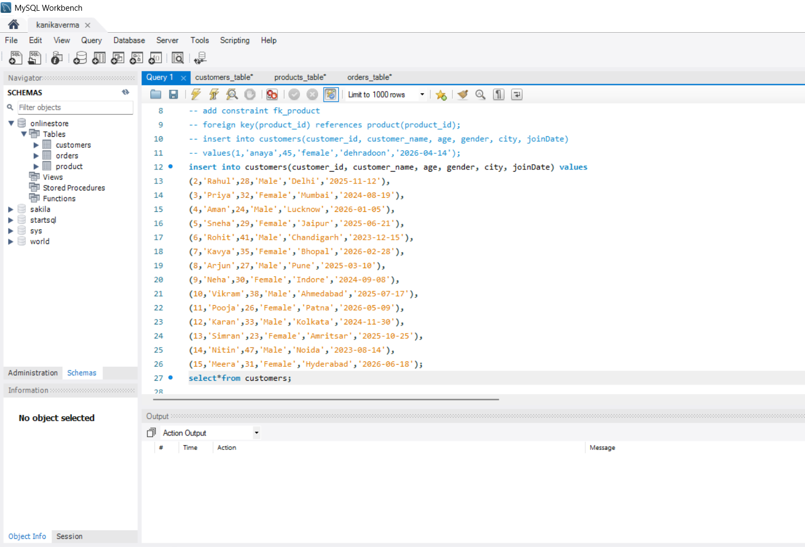
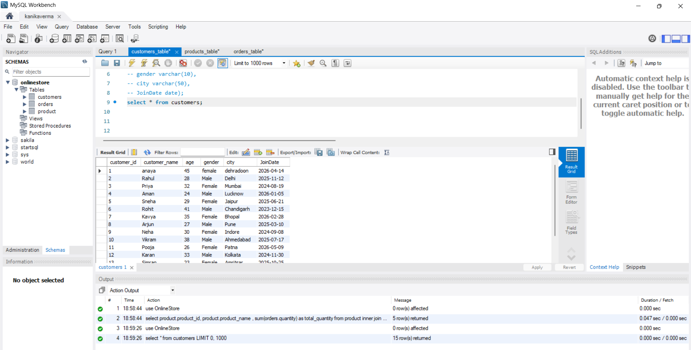
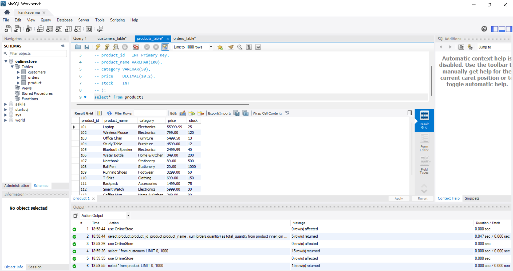
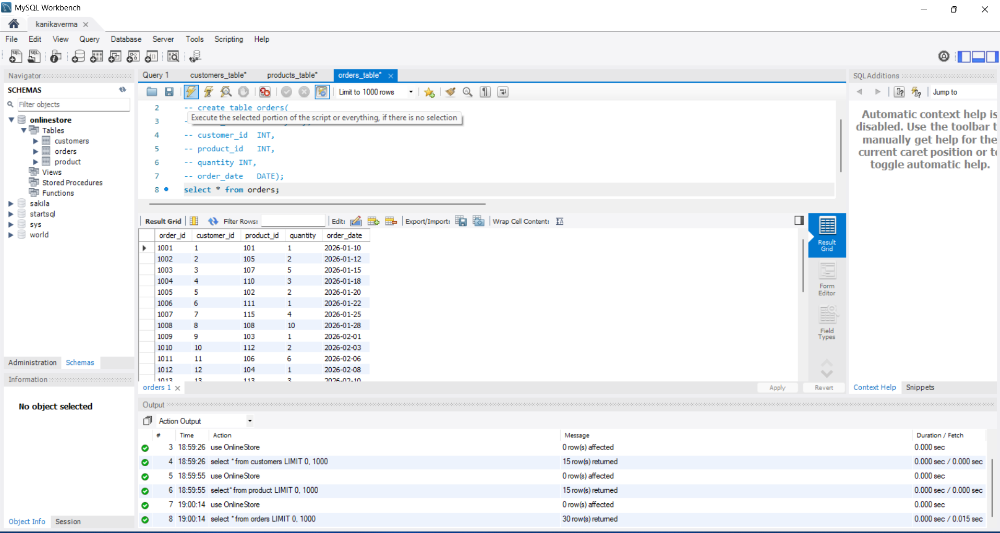
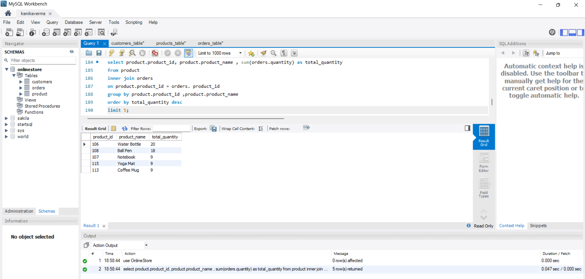

# 📊 SQL Practice Portfolio

## 📌 Project Overview

This repository contains my hands-on SQL practice using an **Online Customer Database**. I created the database, designed tables, and practiced SQL concepts in MySQL Workbench as part of my Data Analyst learning journey.

---

## 🛠️ Tools Used

- MySQL Workbench
- SQL
- Git & GitHub

---

## 📂 Project Files

| File | Description |
|------|-------------|
| customers_table.sql | Customer table creation script |
| products_table.sql | Product table creation script |
| orders_table.sql | Orders table creation script |
| SQL_Practice_Demo.mp4 | SQL practice screen recording |

---

## 🗄️ Database Tables

### 👥 Customers Table

Stores customer information including:
- Customer ID
- Customer Name
- Age
- Gender
- City
- Join Date

---

### 📦 Products Table

Contains product details:
- Product ID
- Product Name
- Category
- Price
- Stock

---

### 🛒 Orders Table

Maintains order information:
- Order ID
- Customer ID
- Product ID
- Order Date
- Quantity
- Total Amount

---

## 📚 SQL Concepts Practiced

- ✅ CREATE DATABASE
- ✅ CREATE TABLE
- ✅ PRIMARY KEY
- ✅ FOREIGN KEY
- ✅ INSERT INTO
- ✅ SELECT
- ✅ WHERE
- ✅ ORDER BY
- ✅ GROUP BY
- ✅ HAVING
- ✅ Aggregate Functions
- ✅ JOINS
- ✅ Subqueries
- ✅ Views
- ✅ Indexes
- ✅ Triggers
- ✅ Database Backup

---

# 📸 Project Screenshots

## Insert Data

---

## Customers Table

---

## Products Table

---

## Orders Table

---

## SQL Query With Output

---

# 🎥 SQL Practice Demo

The complete SQL practice recording is included in this repository.

**File:** `SQL_Practice_Demo.mp4`

---

# 🎯 Learning Outcomes

Through this project I learned:

- Database Design
- Creating Tables
- Managing Relationships
- Writing SQL Queries
- Data Retrieval
- SQL Best Practices
- GitHub Project Documentation

---

# 🚀 Future Work

- Stored Procedures
- Functions
- Window Functions
- Common Table Expressions (CTE)
- Advanced SQL Case Studies

---

# 👩‍💻 Author

**Kanika Verma**

🎓 B.Tech CSE Student

📊 Aspiring Data Analyst

### Skills

- SQL
- MySQL
- Excel
- Power BI
- Python (Learning)

⭐ Thank you for visiting this repository!
